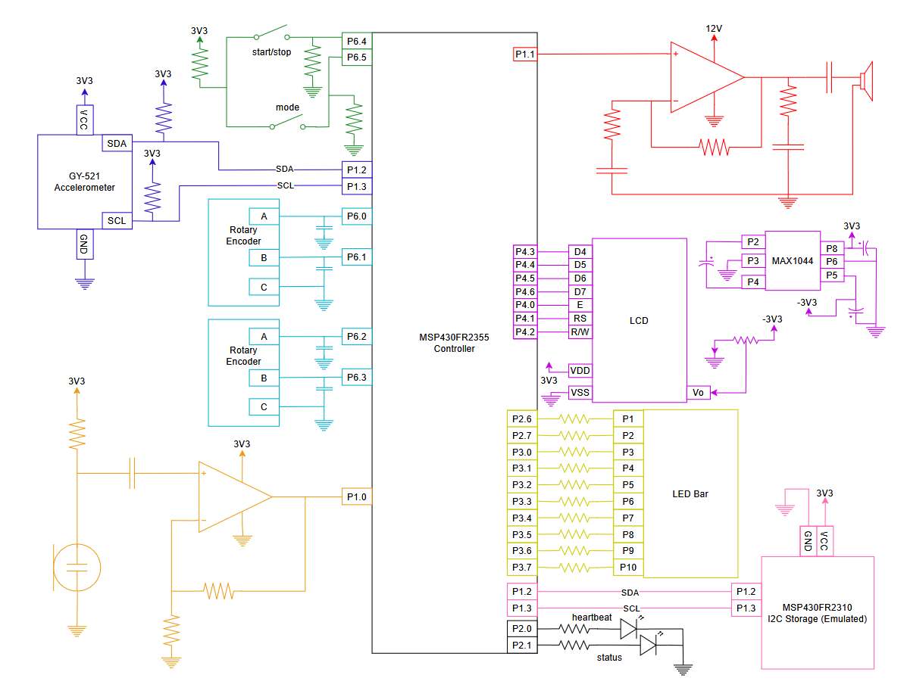
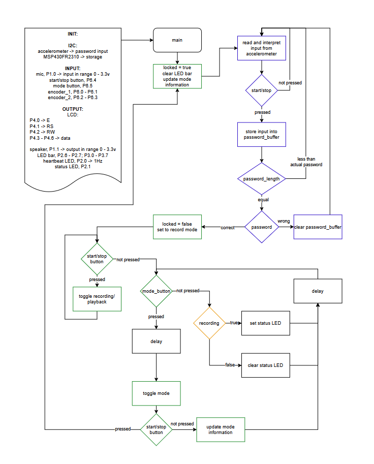
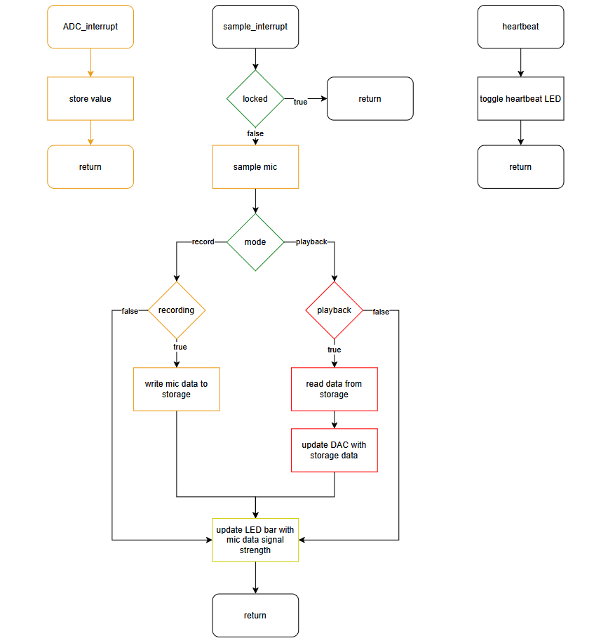
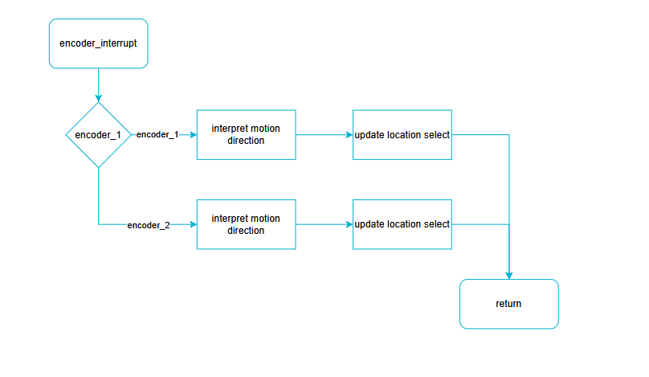

# Final project proposal

- [X] I have reviewed the project guidelines.
- [X] I will be working alone on this project.
- [X] No significant portion of this project will be (or has been) used in other course work.

## Embedded System Description

The goal of this project is to create a password-protected, recording and playback system. This system will have three distinct functions: recording audio from a microphone, outputting audio through a speaker, and a password protection system. Subject to time constraints, the system may also support two speakers with separate playback on each, which would imply two rotary encoders as well.

Inputs:
* Mic: will take in audio input from the user which will be sent to the MSP430FR2355 for processing.
* Rotary Encoder: will be used for selecting a particular location to record into or playback audio from.
* Accelerometer: will be the method by which a user inputs the password. It is 6-axis so a user may designate a tilt and vector of particular magnitude for each input.
* Pushbuttons: will be used to start/stop recording or playback. The pushbuttons will also be used for changing modes: recording, playback, lock

Outputs:
* LCD: will display which mode is selected and pertinent information to that mode. For recording/playback it is the selected location. When locked it is the current password.
* Speaker: will output audio sampled by the MSP430FR2355.
* LED bar: outputs the strength of the received audio.
* Status LED: will represent whether the system is currently recording.

Input / Output:
* i2c storage: emulated by the MSP430FR2310. When in recording mode the sound data will be written to it. When in playback mode the sound data will be read from it.

## Hardware Setup

Required Hardware:
* MSP430FR2355 -> controller

* Mic -> condenser mic / electret mic [CZN-15E], low-noise op amp, resistors, capacitors
* Rotary Encoder -> rotary encoder(s) [PEC12R-2120F-N0012], and based on the datasheet may need resistors and capacitors
* Accelerometer -> 6-axis [GY-521]
* Pushbuttons -> 2, start/stop, switch mode

* LCD -> LCD [668-S16204XRGHS10B], voltage converter [MAX1044CPA+], capacitors
* Speaker -> 4Ω 3W speaker(s), audio op amp(s), resistors, capacitors, these will be powered by an external power supply
* LED bar -> [LTA-1000E], resistors
* Status LED -> red LED, resistor

* MSP430FR2310 -> emulated i2c storage

## Software overview

Execution begins with the system in a locked state and awaiting password input from the user. In the locked state the user will input the password with the accelerometer module, this will be done in 6 DOF - tilt and movement. The LCD will display that the system is locked and will also display each motion the user inputs with the accelerometer. Each input from the user will be interpreted when the start/stop button is pressed.

Upon unlocking the system will move into the record mode. When in record mode the user may use the rotary encoder to select a location to record audio into. To start/stop a recording the user must press the start/stop button. When a recording is ongoing the status LED will light up. The LCD will display that the record mode is selected and what location is selected by the encoder.

When in playback mode the user may use the encoder to select which track should be played on the speaker. If multiple speakers are supported then the speaker will have an encoder dedicated to it which can be used to select the track. The start/stop button will toggle playback for all speakers.

Pressing the mode button will switch between record mode and playback mode. If the mode button and start/stop button are pressed at the same time the system will lock.

Input from the mic will be interpreted in either record or playback mode but not when locked. This interpretation will be sent to the LED bar to display the strength of the audio received.

There will also be a heartbeat LED that blinks at 1Hz.

## Testing Procedure

I will need the usb cable to provide power and an external 12v power supply, which I will bring.

To demo I will first unlock the system with the accelerometer. During this process I will show the LCD displaying input, the process for latching input, and verification of the password.

After unlocking the system I will record some audio. Showing that I can select a location, the signal strength is displayed, that the status LED works, and how the LCD displays things.

I will switch modes to change to playback. Here, I will play the recorded audio and show that it worked.

Then I will lock the system.

## Prescaler

Desired Prescaler level: 

- [ ] 100%
- [X] 95% 
- [ ] 90% 
- [ ] 85% 
- [ ] 80% 
- [ ] 75% 

### Prescalar requirements 

**The inputs to the system will be:**
1.  electret microphone -> used for recording audio
2.  rotary encoder -> used for selecting memory locations
3.  accelerometer -> used for password input
4.  pushbuttons -> used for selecting mode, start/stop recording or playback, latching password input.

**The outputs of the system will be:**
1.  speaker -> used to output audio
2.  LCD -> used to display information about system state
3.  LED bar -> displays strength of received audio from mic
4.  MSP430FR2310 (emulated i2c storage) -> store recorded audio
5.  status LED -> displays whether the system is currently recording

**The project objective is**

The goal of this project is to create a password-protected, recording and playback system. This system will have three distinct functions: recording audio from a microphone, outputting audio through a speaker, and a password protection system. Subject to time constraints, the system may also support two speakers with separate playback on each, which would imply two rotary encoders as well.

**The new hardware or software modules are:**
1.  electret microphone -> used for recording audio
2.  rotary encoder -> used for selecting memory locations
3.  accelerometer -> used for password input
4.  speaker -> used to output audio

The Master will be responsible for:

Recording and outputting audio, controlling the LCD, LED bar, status LED, and receving input from the pushbuttons and rotary encoders.

The Slave(s) will be responsible for:

Storing audio from the microphone which the master will access or write to as needed.

### Argument for Desired Prescaler

* Have 3 inputs and 3 outputs -> I have 4 inputs and 5 outputs (maybe 4).
* Use a mster/slave topology -> I have the controller as the master and the 2310 as a slave, though it is only responsible for being storage.
* Have a "real objective" -> My objective is a system for recording audio: this has applications to industry.
* Include 2 new types of hardware -> I am using 4 items never used before. 
* The new hardware must be somewhat complex to implement -> the mic and speaker require me to learn op-amps which is somewhat difficult. For the accelerometer I need to interpret the angular velocity and tilt which may be fairly difficult. The rotary encoder should not be too difficult.
